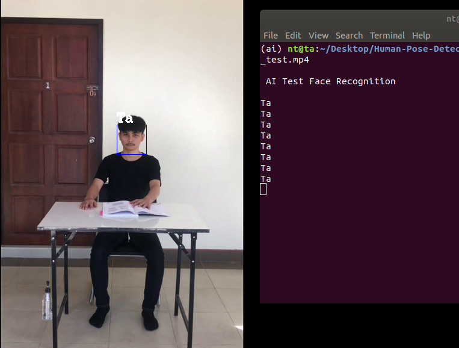

# Face Recognition

### AI ตรวจจับเเละจดจำใบหน้า
ฺ
### Package Install

Install dlib v19 on Ubuntu
```
git clone https://github.com/davisking/dlib.git
cd dlib
mkdir build; cd build; cmake ..; cmake --build .
cd ..
python3 setup.py install
```

### Training model

See : [doc/training.md](./doc/training.md)

### Test - AI  
```
python ./FaceRecognition.py --video=./data_test/face_test.mp4
```
   - class: Ta 
     


